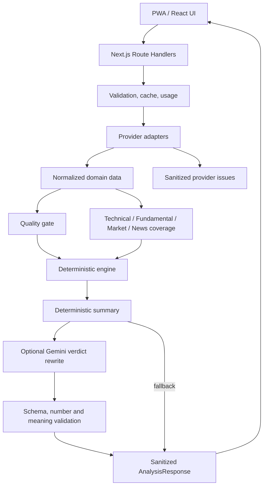
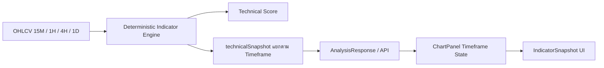

# MarketLens Architecture

## Boundaries

- `src/providers`: third-party knowledge and HTTP mapping
- `src/lib`: environment, errors, cache, usage, validation, security helpers
- `src/engine`: network-free deterministic calculations
- `src/services`: orchestration across providers and engine
- `src/features`: UI state and feature composition
- `src/components`: reusable presentation only
- `src/types`: provider-neutral contracts

## Provider security boundaries

- Shared JSON client จำกัด 1 MB ตามเดิม
- SEC Company Facts ใช้ boundary เฉพาะ `https://data.sec.gov/api/xbrl/companyfacts/` พร้อม exact host allowlist, HTTPS, redirect denial, timeout, JSON content-type และ decompressed-size cap 6 MiB
- SEC project เฉพาะ US-GAAP concepts ที่ engine ใช้ก่อนส่งเข้า normalizer
- Finnhub ส่ง credential ผ่าน `X-Finnhub-Token` ไม่ใส่ใน URL
- Gemini เรียก Models API และเลือก stable Flash จากรายการที่รองรับ `generateContent` ของ key ปัจจุบัน
- Gemini รับเฉพาะ deterministic Verdict และ structured facts ที่จำเป็น ผลลัพธ์ต้องมีเพียง `verdict`; ระบบตรวจจำนวนประโยค ชุดตัวเลข และความหมาย แล้วแทนที่เฉพาะ `summary.overview` หากไม่ผ่านจะเก็บ deterministic Verdict เดิม
- Stooq ต้องส่ง CSV header ที่ตรวจได้และมีแท่งใช้งานจริง; HTML challenge แม้ HTTP 200 ถือว่า unavailable
- Provider issue ที่ส่งกลับ UI มีเพียง provider, safe code และ upstream status ที่ไม่เป็นความลับ

## Cache and usage

V1 uses a five-minute TTL abstraction. The first implementation is suitable for a single server process/local use and exposes its serverless/cross-device limitation. The interface allows a later Redis adapter without changing UI or analysis service contracts.

Market context ใช้ cache แยก 15 นาที โดย key ประกอบด้วย provider, symbol,
timeframe และ output size ทำให้ SPY และ Sector ETF ใช้ร่วมกันข้ามคำขอของหุ้นหลายตัว
ได้ใน serverless instance เดียว เส้นทางวิเคราะห์แบบ cold cache ใช้ Twelve Data
สูงสุด 7 credits: quote 1, หุ้น 4 timeframes, SPY daily 1 และ Sector ETF daily 1

## Durable rate-limit design

V1 ยังใช้ in-memory counter เพราะเป็น Preview สำหรับผู้ใช้คนเดียว จึงไม่ถือเป็น
security boundary เมื่อมีหลาย serverless instances

ตัวเลือกที่ประเมิน:

| ตัวเลือก                              |                       Atomic | Serverless | ข้อสรุป                                                  |
| ------------------------------------- | ---------------------------: | ---------: | -------------------------------------------------------- |
| Vercel KV เดิม                        |                          ได้ |        ได้ | ผลิตภัณฑ์เดิมถูกย้ายไป Marketplace ไม่เลือกสำหรับงานใหม่ |
| Upstash Redis ผ่าน Vercel Marketplace |      ได้ผ่าน transaction/Lua |        ได้ | ตัวเลือกแนะนำ                                            |
| PostgreSQL counter                    | ได้ผ่าน transaction/row lock |        ได้ | เหมาะเมื่อมีฐานข้อมูลผู้ใช้อยู่แล้ว แต่หนักเกิน V1       |

แผน Upstash:

1. สร้าง key `usage:{clientHash}:{bangkokDate}` โดย hash client id ด้วย
   `USAGE_SIGNING_SECRET`
2. ตรวจ cache การวิเคราะห์หุ้นเดิม 5 นาทีก่อนแตะ counter
3. จองสิทธิ์แบบ atomic เฉพาะเมื่อ counter ยังต่ำกว่า 10 และตั้ง TTL ถึงเที่ยงคืน
   Asia/Bangkok
4. ทำ analysis และ commit การใช้สิทธิ์เมื่อสำเร็จเท่านั้น; กรณีล้มเหลวต้อง rollback
   reservation แบบ atomic
5. ใช้ idempotency key ต่อคำขอเพื่อกัน double charge จาก retry
6. fail closed สำหรับคำขอใหม่เมื่อ durable store ล้ม แต่ยังคืน cached analysis
   ที่ตรวจสอบแล้วได้โดยไม่หักรอบ

Environment variables ในอนาคต: `UPSTASH_REDIS_REST_URL` และ
`UPSTASH_REDIS_REST_TOKEN` ฝั่ง server เท่านั้น การเปิดใช้ต้องเพิ่ม integration
tests สำหรับ concurrency, Bangkok reset, failed analysis และ cached analysis
ก่อนเปลี่ยน implementation จริง

## Extension path

Add provider adapters or security-type-specific fundamental strategies behind existing interfaces. Do not add conditional formulas throughout the UI.

## Technical Indicator Snapshot

เส้นทางข้อมูลของ Indicator Snapshot ใช้ OHLCV ชุดเดียวกับ Technical Score:

- ไม่มีการเรียก Twelve Data เพิ่มเพื่อขอ EMA, RSI, MACD, ADX, ATR, OBV หรือ Volume Metrics
- `technicalSnapshot` อยู่ระดับบนของ `AnalysisResponse` และมีครบทั้ง `15m`, `1h`, `4h`, `1d`
- ฝั่ง Browser ตรวจ Snapshot contract ด้วย Zod ก่อนนำผล API ไปแสดง
- `ChartPanel` ใช้ timeframe state เดียวกันเลือกทั้ง candles และ Snapshot ทำให้กราฟกับตัวเลขเปลี่ยนพร้อมกัน
- ค่าที่คำนวณไม่ได้เป็น `null` พร้อมเหตุผลราย field ห้ามแทนด้วย `0`
