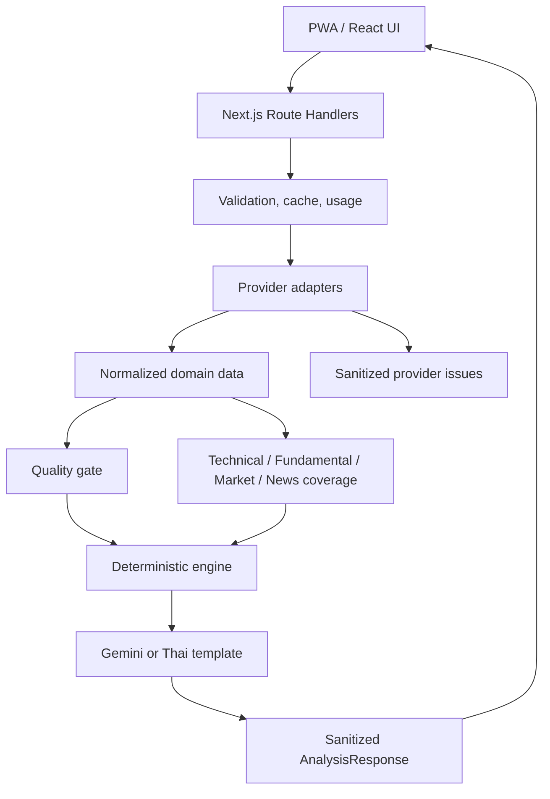

# MarketLens Architecture

## Boundaries

- `src/providers`: third-party knowledge and HTTP mapping
- `src/lib`: environment, errors, cache, usage, validation, security helpers
- `src/engine`: network-free deterministic calculations
- `src/services`: orchestration across providers and engine
- `src/features`: UI state and feature composition
- `src/components`: reusable presentation only
- `src/types`: provider-neutral contracts

## Provider security boundaries

- Shared JSON client จำกัด 1 MB ตามเดิม
- SEC Company Facts ใช้ boundary เฉพาะ `https://data.sec.gov/api/xbrl/companyfacts/` พร้อม exact host allowlist, HTTPS, redirect denial, timeout, JSON content-type และ decompressed-size cap 6 MiB
- SEC project เฉพาะ US-GAAP concepts ที่ engine ใช้ก่อนส่งเข้า normalizer
- Finnhub ส่ง credential ผ่าน `X-Finnhub-Token` ไม่ใส่ใน URL
- Gemini เรียก Models API และเลือก stable Flash จากรายการที่รองรับ `generateContent` ของ key ปัจจุบัน
- Stooq ต้องส่ง CSV header ที่ตรวจได้และมีแท่งใช้งานจริง; HTML challenge แม้ HTTP 200 ถือว่า unavailable
- Provider issue ที่ส่งกลับ UI มีเพียง provider, safe code และ upstream status ที่ไม่เป็นความลับ

## Cache and usage

V1 uses a five-minute TTL abstraction. The first implementation is suitable for a single server process/local use and exposes its serverless/cross-device limitation. The interface allows a later Redis adapter without changing UI or analysis service contracts.

## Extension path

Add provider adapters or security-type-specific fundamental strategies behind existing interfaces. Do not add conditional formulas throughout the UI.
