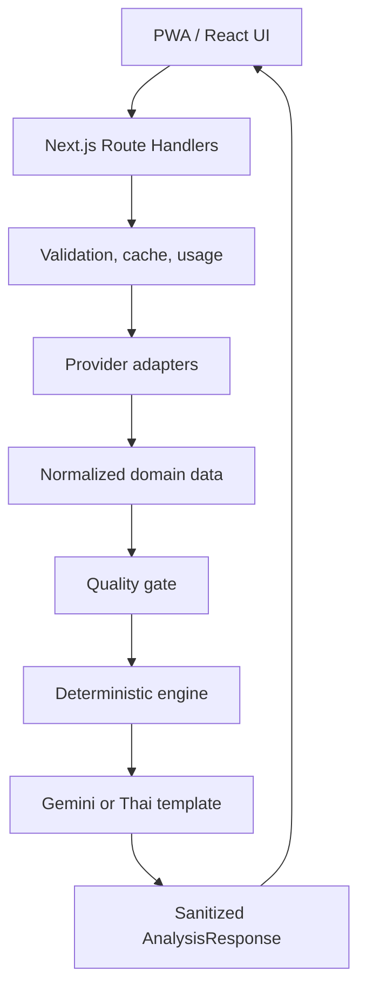

# MarketLens Architecture

## Boundaries

- `src/providers`: third-party knowledge and HTTP mapping
- `src/lib`: environment, errors, cache, usage, validation, security helpers
- `src/engine`: network-free deterministic calculations
- `src/services`: orchestration across providers and engine
- `src/features`: UI state and feature composition
- `src/components`: reusable presentation only
- `src/types`: provider-neutral contracts

## Cache and usage

V1 uses a five-minute TTL abstraction. The first implementation is suitable for a single server process/local use and exposes its serverless/cross-device limitation. The interface allows a later Redis adapter without changing UI or analysis service contracts.

## Extension path

Add provider adapters or security-type-specific fundamental strategies behind existing interfaces. Do not add conditional formulas throughout the UI.
