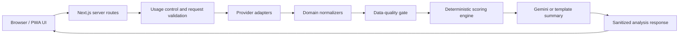

# MarketLens V1 Design Specification

Date: 2026-07-18
Status: Approved concept, pending written-spec review
Product: MarketLens – Intelligent Stock Analysis

## 1. Product intent

MarketLens is a mobile-first PWA for analyzing ordinary US-listed operating companies. It combines market data, financial filings, news, deterministic scoring, and a Thai-language explanation layer. It is an educational decision-support tool, not a broker, trading system, or return guarantee.

The product must keep three ideas separate:

1. Is the business financially strong?
2. Is the current valuation reasonable?
3. Is the current market setup attractive relative to its risk?

The UI must explain why a score exists. No score may be produced solely by an AI model.

## 2. Confirmed scope

### Included in V1

- Ticker search for ordinary US-listed companies.
- Quote, OHLCV, candlestick chart, volume, and data freshness.
- Technical, fundamental, market/sector, news/event, risk, and data-quality analysis.
- Short-, medium-, and long-horizon scores.
- Thai explanation via Gemini with a deterministic template fallback.
- Mock mode that clearly labels simulated data.
- Five result sections: Overview, Chart, Fundamentals, Risk, and Summary.
- Ten successful analyses per Bangkok calendar day.
- Five-minute cache for repeated requests.
- Installable PWA and offline application shell.
- Local-only development, testing, Git history, and phase reports.

### Explicitly excluded from full V1 scoring

- Banks, insurers, REITs, ETFs, pre-revenue biotech, commodity producers, crypto, and options.
- Portfolio tracking, account system, persistent market-data storage, stock screener, full backtesting, brokerage connection, and live trading.
- Git remote creation, GitHub push, Vercel deployment, production connection, or real API secrets.

Unsupported security types may receive limited market/technical context only when the available data is appropriate. The UI must state that the general-company fundamental model is not valid for them.

## 3. Chosen implementation approach

### Selected: mock-first modular monolith

MarketLens will be one Next.js application with strict internal module boundaries:

- Server routes own all third-party access.
- Provider adapters isolate Twelve Data, SEC EDGAR, Finnhub, Stooq, Gemini, and mock data.
- Normalizers convert provider payloads into provider-neutral domain types.
- A quality gate validates completeness, freshness, consistency, and security type.
- Pure calculation functions create scores and auditable reasons.
- The summary layer receives only structured, computed facts.
- React UI consumes one sanitized analysis response.

Mock mode is the default until real environment variables are supplied. Simulated data must always carry a visible `ข้อมูลจำลอง` label.

### Alternatives rejected

1. **UI-first prototype:** faster initially, but would couple presentation to guessed payloads and cause rework when scoring and provider failures are introduced.
2. **Live-API-first build:** closer to production data, but makes development dependent on keys, quotas, provider uptime, and licensing details before the core engine is testable.

## 4. System architecture

### Module boundaries

- `providers`: provider-specific requests, timeouts, retry policy, and error mapping.
- `lib/api`: request orchestration and shared HTTP behavior.
- `engine`: pure calculations without network or UI dependencies.
- `features`: user-facing feature logic and presentation orchestration.
- `components`: reusable visual primitives and domain components.
- `types`: normalized domain contracts shared between server and UI.

No client module may import a provider SDK, secret environment variable, or server-only adapter.

## 5. Data sources and fallback behavior

| Domain | Primary source | Fallback or degradation |
|---|---|---|
| Quote and OHLCV | Twelve Data | Stooq only when suitable; clearly mark delayed/backup data |
| Financial filings | SEC EDGAR | Omit affected fundamental factors and reduce quality |
| Profile, news, earnings events | Finnhub | Continue without unavailable news/event factors and reduce quality |
| Thai narrative | Gemini | Deterministic Thai template |
| Local development | Mock provider | Explicit simulated-data badge |

Provider failures must be isolated. A missing optional news feed must not erase valid technical results, while missing critical quote/OHLCV data must stop technical scoring.

All outbound requests use timeouts. Retry is bounded and applies only to appropriate network or 5xx failures. Never retry confirmed 401, 403, 404, or 429 responses.

## 6. Data-quality gate

`Q` ranges from 0 to 100 and represents evidence quality, not stock attractiveness. It never adds to a horizon score.

Quality considers:

- Quote freshness and stated market session.
- OHLCV completeness and duplicate/missing bars.
- Split/dividend adjustment status where known.
- Cross-source consistency.
- Financial statement coverage and recency.
- Correct symbol, exchange, timezone, and security type.
- Traceable provider and update timestamps.

Behavior:

- `Q >= 75`: normal analysis.
- `60 <= Q < 75`: analyze with a prominent warning.
- `Q < 60`: do not issue entry/exit scenarios or full horizon conclusions.
- A quote discrepancy over 1% triggers a warning; over 2% suspends technical scoring until session/split causes are resolved.
- Missing values remain `null`/unavailable and are never replaced with zero.

## 7. Scoring model

All numerical scores are clamped to 0–100 and accompanied by machine-readable reasons and an audit breakdown.

### Technical score `T`

- Trend and EMA: 30
- RSI and MACD: 20
- ADX and directional movement: 10
- Volume, VWAP, and OBV: 15
- Support/resistance and reward/risk: 15
- ATR and Bollinger behavior: 10

Multi-timeframe aggregation:

- 1D: 40%
- 4H: 30%
- 1H: 20%
- 15M: 10%

Signals based on the current unfinished bar must be marked provisional. Confirmed scoring uses closed bars.

### Market/sector score `M`

- Relative strength versus broad market: 30
- Relative strength versus sector: 30
- Broad-market trend: 15
- Sector trend: 15
- Market volatility regime: 10

Relative strength uses 1D, 5D, 20D, and 60D windows with increasing weight on 20D/60D context.

### Fundamental score `F`

- Growth and earnings delivery: 25
- Profitability and cash conversion: 20
- Debt and financial health: 15
- ROIC versus WACC: 15
- Valuation: 15
- Product/business direction: 10

Reference signals such as revenue growth above 10%, EPS growth above 15%, and net debt/EBITDA below 2.5x are contextual inputs, not universal pass/fail gates. Margins and multiples must be compared with the company’s history and appropriate industry peers. Estimated WACC must expose limitations and must not be fabricated when inputs are missing.

### News/event score `E`

Starts at 50. Adjustments account for source authority, recency, relevance, duplication, and severity. SEC filings and direct company releases outrank major financial news, analyst commentary, and unverified social claims. Social claims receive no score until verified.

### Risk score `R`

Higher means riskier:

- Volatility: 20
- Liquidity: 15
- Event proximity: 15
- Financial risk: 20
- Technical damage: 10
- Dilution/accounting risk: 10
- Business concentration: 10

Risk penalties are capped:

- 0–30: no deduction
- 31–50: deduct 3
- 51–70: deduct 8
- 71–85: deduct 15
- 86–100: deduct 25

### Horizon scores

- Short: `T 50% + M 20% + E 20% + F 10% - risk penalty`
- Medium: `T 35% + M 20% + F 30% + E 15% - risk penalty`
- Long: `F 60% + T 15% + M 10% + E 15% - risk penalty`

`Q` and confidence `C` never act as bonuses.

### Confidence `C`

V1 shows no fabricated confidence number. It displays that Backtest and Paper Trade evidence is insufficient. The architecture reserves future inputs for out-of-sample tests, walk-forward validation, regime coverage, sample size, calibration, and paper-trade consistency.

## 8. Support, resistance, and scenarios

The engine produces price zones, not false-precision single levels. It combines swing highs/lows, EMA confluence, pivot context, price-volume zones, ATR-scaled width, recency, repeated tests, and multi-timeframe agreement.

The UI shows at most three support and three resistance zones. Entry, stop, and target outputs are scenarios rather than orders:

- Support reaction scenario.
- Confirmed breakout scenario.
- Breakout-retest scenario.

Stops sit beyond the invalidation zone with an ATR allowance. Targets use the next credible resistance/support zones. Reward/risk below 1.5:1 is labeled unattractive; 2:1 or higher is preferred only when the target is technically plausible.

## 9. Usage control and caching

- Ten successful new analyses per Bangkok calendar day.
- Failed validation, provider errors, and incomplete analyses do not consume a round.
- Repeating the same symbol within five minutes uses cache and does not consume another round.
- UI disables duplicate submissions while a request is active.
- Server performs the authoritative check available to V1.
- Any 429 response stops retry immediately.

Because V1 has no durable shared database or account identity, cross-device enforcement cannot be guaranteed. This limitation must be documented and the UI must not claim otherwise. The server design should permit a later Redis-backed counter without changing feature contracts.

## 10. AI summary safety

Gemini receives structured facts only: scores, computed reasons, material metrics, risk factors, scenarios, quality warnings, and source timestamps. It may simplify Thai prose but may not calculate, change, infer, or invent numbers.

The output is schema-validated. Any numeric token not traceable to the supplied input invalidates the AI response and activates the deterministic template fallback. Gemini timeout, missing key, 429, invalid JSON, or unsafe output must not block the underlying analysis.

## 11. User experience

### Visual language

- Bright white/light-gray canvas; no dark theme in V1.
- Navy/blue primary accents, restrained green positive states, gold warnings, orange risk, red critical states, and gray unavailable states.
- Human-designed financial-tool feel: varied card composition, thin dividers, restrained shadows, useful whitespace, and no heavy glassmorphism, neon, crypto motifs, or chatbot styling.
- Fonts: Geist/Inter for Latin and numbers, Noto Sans Thai for Thai.
- Lucide icons plus a custom lens/candlestick SVG mark.

### Core screens

1. **Home:** brand, ticker search, rounds remaining, reset time, provider/mock status, market pulse, recent searches.
2. **Overview:** profile, quote, freshness, quality, horizon score rings, component scores, concise conclusion.
3. **Chart:** 15M/1H/4H/1D candlesticks, EMA overlays, volume, indicators, zones, and scenarios.
4. **Fundamentals:** growth, margins, cash flow, debt, ROIC/WACC, valuation, dilution, earnings delivery, and business direction.
5. **Risk:** risk score, factor severity, evidence, source, and timestamp.
6. **Summary:** Thai insight, strengths, weaknesses, watch items, good/neutral/bad scenarios, limitations, and disclaimer.

Bottom navigation exposes Overview, Chart, Fundamentals, Risk, and Summary with safe-area support and accessible labels.

## 12. PWA and offline behavior

The app includes a manifest, multi-size icons, Apple touch icon, standalone mode, safe-area styling, service worker, offline shell, and safe update behavior. Cached analysis results must retain their original timestamps and be labeled stale/offline. The service worker must not present expired market data as current.

## 13. Error model

The application uses stable codes including:

- `INVALID_SYMBOL`
- `SYMBOL_NOT_FOUND`
- `UNSUPPORTED_SECURITY_TYPE`
- `INSUFFICIENT_DATA`
- `LOW_DATA_QUALITY`
- `PROVIDER_UNAVAILABLE`
- `PROVIDER_RATE_LIMITED`
- `PROVIDER_AUTH_ERROR`
- `MARKET_DATA_STALE`
- `SEC_DATA_UNAVAILABLE`
- `NEWS_UNAVAILABLE`
- `GEMINI_UNAVAILABLE`
- `DAILY_LIMIT_REACHED`
- `REQUEST_TIMEOUT`
- `VALIDATION_ERROR`
- `INTERNAL_ERROR`
- `MOCK_MODE_ACTIVE`

Client messages are in plain Thai and include a safe next action. Responses never expose stack traces, internal paths, secret headers, or credentials.

## 14. Security and privacy

- Secrets are server-only and validated centrally with Zod.
- `.env.example` contains names only; real `.env*` files remain ignored.
- No secret uses a `NEXT_PUBLIC_` prefix.
- Symbol input is normalized and allowlisted.
- Outputs are sanitized and response sizes bounded.
- Requests use timeouts, bounded retries, and security headers.
- Logs redact credentials and sensitive headers.
- Tests inspect the client bundle and repository for secret leakage.
- No personal portfolio or account data is sent to Gemini.

## 15. Testing strategy

### Unit tests

- Every indicator and score function.
- Bullish, neutral, bearish, missing-data, extreme-value, zero-division, negative-earnings, high-debt, dilution, low-quality, unsupported-security, clamping, penalty, and timeframe-weight cases.
- AI number traceability and template fallback.

### Component tests

- Accessible score components, badges, errors, loading, navigation, and mock labels.

### Integration tests

- Provider adapters with mocked HTTP.
- Route validation, timeouts, cache, partial failures, auth errors, and 429 handling.
- No direct provider calls from the browser.

### End-to-end tests

- Home-to-analysis critical flow in mock mode.
- Mobile and desktop navigation.
- Invalid symbol, unsupported type, daily limit, partial data, offline shell, and stale-data labels.

### Release checks

- Lint, strict typecheck, unit/component/integration tests, E2E tests, production build, secret scan, dependency audit review, PWA validation, accessibility pass, and client-bundle inspection.

## 16. Phase boundaries and local Git policy

Work proceeds through nine local phases: foundation/docs, design system, UI, providers/API, calculation engine, Gemini/fallback, PWA/offline, QA, and final performance/security audit. Each completed phase updates `PROGRESS.md`, passes its required checks, and creates a local commit.

No Git remote may be added. No GitHub command, Vercel command, push, preview deployment, or production deployment is allowed. If local Git identity is unavailable, work continues and the missing commits are documented without changing global credentials.

## 17. Acceptance criteria

MarketLens V1 is locally complete only when:

- Mock mode supports the full critical user flow.
- Mobile UI, five analysis sections, score explanations, and quality gating work.
- Calculation functions are deterministic, bounded, and well tested.
- Provider access and Gemini remain server-only.
- Template summary works without Gemini.
- PWA installability and offline shell are verified.
- Lint, strict typecheck, automated tests, E2E critical flow, production build, and secret scan have actually run successfully.
- Final audit, test, security, and deployment-readiness reports truthfully state remaining limitations.
- The repository has no remote and nothing has been pushed or deployed.

## 18. Design self-review

- No unresolved `TBD` or placeholder requirement remains.
- V1 scope is separated from future features.
- The architecture supports mock-first development and later real providers without UI coupling.
- Quality and confidence cannot inflate stock scores.
- Risk deductions match the approved thresholds and remain capped.
- Missing data is not treated as zero.
- Unsupported security types cannot receive misleading general-company fundamentals.
- AI prose cannot override deterministic calculations.
- Usage-limit claims accurately acknowledge the lack of durable cross-device storage.
- Deployment actions remain outside the current authorization.
