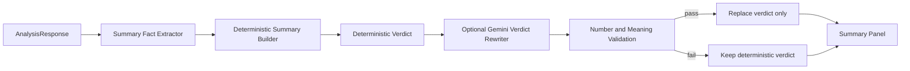

# MarketLens Summary Redesign Design

วันที่: 2026-07-27
สถานะ: อนุมัติแล้ว
แนวทาง: Deterministic Summary + Gemini เฉพาะเรียบเรียง Verdict

## เป้าหมาย

ทำให้หน้า Summary อ่านแล้วเข้าใจผลวิเคราะห์ได้ทันทีโดยไม่ต้องรู้ศัพท์ภายในระบบ ทุกข้อสรุปต้องตรวจย้อนกลับไปยัง Structured Data ของ `AnalysisResponse` ได้ และเมื่อข้อมูลไม่พอต้องระบุชื่อข้อมูลที่ขาดอย่างเจาะจง

## ขอบเขตอำนาจของระบบ

Deterministic Summary Engine เป็นเจ้าของ:

- สถานะระยะสั้น กลาง และยาว
- ตัวเลขและคะแนนทั้งหมด
- จุดแข็ง จุดอ่อน และความเสี่ยง
- สิ่งที่ต้องติดตาม
- Good / Neutral / Bad Scenario
- ข้อจำกัดของข้อมูล
- Verdict Template ตั้งต้น

Gemini มีสิทธิ์เปลี่ยนเฉพาะข้อความ Verdict 2–3 ประโยค ห้ามเปลี่ยนหรือสร้างตัวเลข คะแนน สถานะรายระยะ แนวรับ แนวต้าน เหตุผล และ Scenario

## Data Flow

## Summary Contract

`AnalysisSummary` เพิ่มข้อมูลต่อไปนี้:

- `overview`: Verdict 2–3 ประโยค
- `horizons`: `short`, `medium`, `long` แต่ละช่วงมีชื่อ สถานะ คะแนนที่แสดงได้ เหตุผล และรายการข้อมูลที่ขาด
- `strengths`: เหตุผลเชิงบวกจากข้อมูลจริง
- `weaknesses`: ข้อเสียหรือข้อมูลสำคัญที่ขาด
- `risks`: ปัจจัยความเสี่ยงพร้อมสาเหตุ
- `watchItems`: 3–5 รายการจาก Support, Resistance, EMA, Volume, Earnings และข้อมูลที่ขาด
- `scenarios`: Good / Neutral / Bad ที่เขียนเป็นเงื่อนไข
- `limitations`: ชื่อข้อมูลที่ขาดและข้อจำกัดทางสถิติ
- `disclaimer`: ข้อความไม่ใช่คำแนะนำหรือคำสั่งซื้อขาย

## Horizon Status

สถานะที่ผู้ใช้เห็น:

- `ข้อมูลไม่เพียงพอ`: Horizon เป็น `insufficient`, มี Missing Modules หรือ Coverage ของโมดูลสำคัญต่ำกว่าเกณฑ์
- `ระวัง`: คะแนนต่ำกว่า 45 หรือ Risk สูงตั้งแต่ 61
- `เป็นกลาง`: คะแนน 45–69 และข้อมูลผ่านเกณฑ์
- `มีสัญญาณบวก`: คะแนนตั้งแต่ 70, Coverage ผ่านเกณฑ์ และ Risk ต่ำกว่า 61

เกณฑ์ Coverage:

- ระยะสั้น: Technical อย่างน้อย 85%, Fundamental อย่างน้อย 25%, Market อย่างน้อย 50%, News อย่างน้อย 50%
- ระยะกลาง: Technical อย่างน้อย 70%, Fundamental อย่างน้อย 50%, Market อย่างน้อย 50%, News อย่างน้อย 25%
- ระยะยาว: Technical อย่างน้อย 50%, Fundamental อย่างน้อย 70%, Market อย่างน้อย 25%, News อย่างน้อย 25%

หากไม่ผ่านเกณฑ์ ให้ซ่อนคะแนนรายระยะและแสดงรายการข้อมูลที่ขาด ห้ามใช้คะแนนที่คำนวณได้บางส่วนสร้างสถานะเชิงบวก

## Structured Evidence

Summary Builder ใช้เฉพาะ:

- `quote.changePercent`
- `technicalSnapshot["1d"]` ได้แก่ latestClose, EMA20, EMA50, currentVolume, averageVolume20 และ volumeRatio
- `fundamentals` ได้แก่ Revenue/EPS growth, margins, free cash flow, debt, valuation และ earnings fields
- `scores.coverage`
- `scores.horizons`
- `scores.risk`
- `scores.risk.reasons` และ warnings
- `events`
- `supports` และ `resistances`
- `providerIssues`

Missing Fundamental ต้องระบุชื่อ metric จาก Coverage หรือค่าที่เป็น `null` เช่น `ไม่มีข้อมูล Valuation`, `ข้อมูลหนี้ไม่ครบ` และ `ข้อมูลรายได้/EPS ไม่ครบ` ไม่ใช้ข้อความกว้างเพียงว่า “ข้อมูลไม่ครบ”

## Scenario Rules

- กรณีดี: ใช้การปิดเหนือ Resistance, ราคาเหนือ EMA20/EMA50 และ Volume เหนือค่าเฉลี่ย เฉพาะข้อมูลที่มี
- กรณีกลาง: ใช้กรอบ Support–Resistance และภาวะ Volume/EMA ที่ยังไม่ยืนยัน
- กรณีแย่: ใช้การปิดต่ำกว่า Support, ราคาอยู่ต่ำกว่า EMA20/EMA50 หรือ Risk Factors ที่มีจริง
- ถ้า Support, Resistance, EMA หรือ Volume ไม่มี ให้ตัดเงื่อนไขนั้นออก
- ทุก Scenario ใช้ถ้อยคำ “หาก/ตราบใดที่/เมื่อ” ไม่ใช้คำทำนายและไม่ออกคำสั่งซื้อขาย

## Gemini Safety Boundary

Gemini รับ:

- Deterministic Verdict
- ชุดข้อเท็จจริงที่อนุญาต
- คำสั่งให้เรียบเรียง 2–3 ประโยคเท่านั้น

Gemini Output ต้อง:

- เป็น object ที่มี `verdict` เพียง field เดียว
- มี 2–3 ประโยค
- ตัวเลขทุกตัวอยู่ใน Structured Data
- ไม่กล่าวถึงคะแนน สถานะ แนวรับ แนวต้าน หรือข้อเท็จจริงที่ไม่มีใน Input
- ไม่เปลี่ยน polarity และสาระหลักของ Deterministic Verdict

หาก Schema, Number Validation หรือ Meaning Validation ไม่ผ่าน ให้ใช้ Deterministic Verdict และบันทึก `summarySource = "template"` พร้อม safe provider issue

## UI Order

1. Verdict Card พร้อมป้าย “สรุปโดย MarketLens”
2. สถานะระยะสั้น กลาง และยาว
3. เหตุผลสนับสนุน
4. ความเสี่ยง
5. สิ่งที่ต้องติดตาม
6. Good / Neutral / Bad Scenario
7. ข้อจำกัดของข้อมูล
8. Disclaimer

ข้อมูลว่าใช้ Gemini หรือ Deterministic Template อยู่ใน Info Disclosure เท่านั้น ไม่แสดง “Template Fallback” บนหน้าหลัก

## Testing

ต้องมี Test อย่างน้อย:

- Summary ข้อมูลครบ
- Market Coverage ต่ำกว่าเกณฑ์
- Fundamental Coverage ต่ำกว่าเกณฑ์
- Horizon มีคะแนนแต่ Coverage ไม่ผ่าน ต้องซ่อนคะแนน
- Gemini Output ไม่ผ่าน Schema/Meaning Validation
- Gemini เพิ่มหรือเปลี่ยนตัวเลข
- Scenario ไม่มี Support/Resistance แล้วต้องไม่สร้างระดับราคา
- Component แสดงลำดับส่วนและ Info Disclosure ถูกต้อง
- E2E มือถือและเดสก์ท็อปตรวจ Summary ใหม่

## ข้อจำกัด

- ไม่เปลี่ยนสูตรคะแนนหลัก
- ไม่ลด Quality Gate
- ไม่เพิ่มแหล่งข้อมูลหรือ API call
- ไม่ Deploy Production
